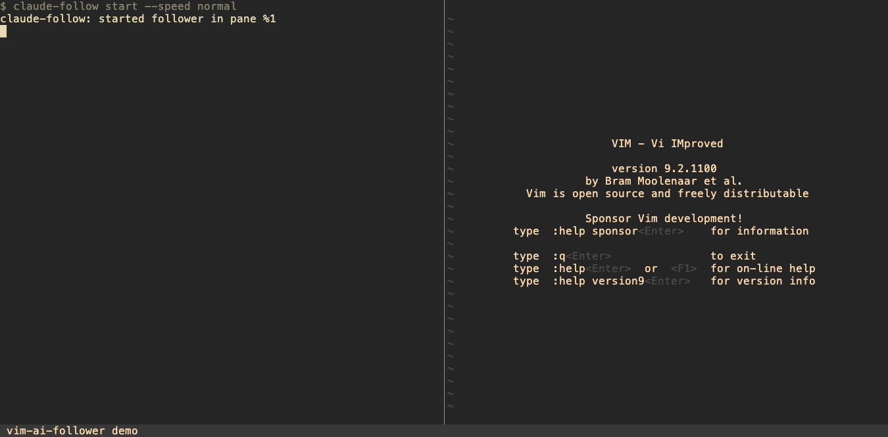
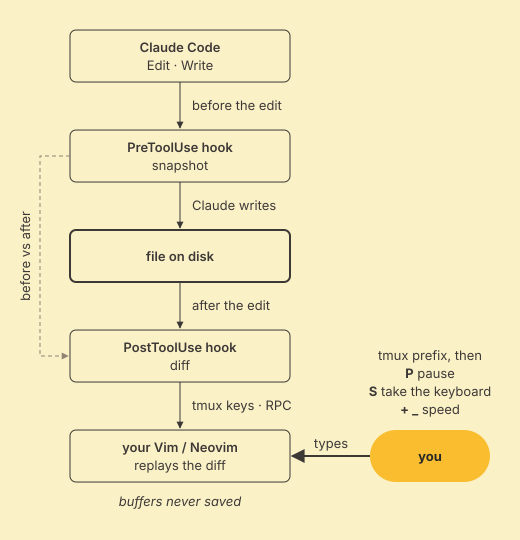

🇺🇸 [English](README.md) · 🇧🇷 [Português](README.pt.md)

# Veja o Claude Code digitar no seu próprio Vim.

Cada edição é reproduzida linha a linha, num ritmo que dá pra acompanhar de verdade — pause, pegue o teclado, devolva.

Feito por Alberto Cavalcanti · [Conecte-se no LinkedIn](https://www.linkedin.com/in/albertosca/) · [Leia a documentação](https://albertosca.github.io/vim-ai-follower/pt/) · [Instalação](#instalação)

<!-- facts -->1000+ testes de unidade no CI · 100% de branch coverage na suíte completa · backends Vim + Neovim · v0.2.9<!-- /facts -->

[](https://github.com/albertosca/vim-ai-follower/actions/workflows/ci.yml) [](https://github.com/albertosca/vim-ai-follower/actions/workflows/lint.yml) [](https://github.com/albertosca/vim-ai-follower/actions/workflows/ci.yml) [](LICENSE) [](pyproject.toml) [](https://code.claude.com/docs/en/plugins)

## Veja funcionando



*Payloads de hook roteirizados, follower real — gravado com vhs a partir de [`assets/demo/follow.tape`](assets/demo/follow.tape).*

## Como funciona

<picture>
  <source media="(prefers-color-scheme: dark)" srcset="assets/diagrams/how-it-works-dark.svg">
  
</picture>

- O `Edit` ou o `Write` do Claude Code chega ao disco primeiro; um hook `PreToolUse` já tinha guardado o conteúdo antigo.
- Um hook `PostToolUse` compara o conteúdo antigo com o novo e reproduz a mudança no seu Vim (`tmux send-keys`) ou no Neovim (RPC).
- Num `Read`, o follower navega até aquele arquivo e linha.
- Você continua no controle: `prefix` `P` pausa, `prefix` `S` pega o teclado, e salvar a sua versão devolve o controle (use `:w!` se o Vim acusar E13).

## O que ele não faz

- **Nunca escreve nos seus arquivos.** Os buffers do follower nunca são salvos, e ficam travados como somente-leitura entre as animações (um Neovim adotado é a exceção: é o seu próprio editor, então nunca é travado).
- **Nunca derruba uma chamada de ferramenta do Claude Code.** Os hooks são feitos para sair com `0` e registrar problemas em `hook.log`, em vez de falhar a chamada.
- **Nada sai da sua máquina.** O pacote não importa nenhum módulo de rede, e o Neovim é acessado por um socket local.

A animação leva tempo mesmo — é pra isso que servem as teclas de velocidade e o mudo.

## Decisões de engenharia

O vim-ai-follower digita num editor que você está olhando, a partir de hooks que rodam dentro de cada chamada de ferramenta do Claude Code. Então a régua é: nunca corromper o que você vê, nunca atrapalhar o Claude, e nunca digitar na janela errada. Cada decisão abaixo garantiu uma dessas coisas, a um custo; a [página de Engenharia](https://albertosca.github.io/vim-ai-follower/pt/engineering/) registra o que cada uma custou e onde conferir no código.

| Decisão | Trade-off aceito, e a evidência |
|---|---|
| [Dois backends: `send-keys` do tmux pra qualquer Vim, RPC pro Neovim](https://albertosca.github.io/vim-ai-follower/pt/engineering/#dois-backends-send-keys-do-tmux-pra-qualquer-vim-rpc-pro-neovim) | Duas implementações de um mesmo protocolo de follower. As colunas do RPC são offsets em bytes: um travessão corrompia o texto digitado até [`ffaed50`](https://github.com/albertosca/vim-ai-follower/commit/ffaed50), agora preso por um teste contra um Neovim real |
| [Hooks nunca derrubam uma chamada de ferramenta](https://albertosca.github.io/vim-ai-follower/pt/engineering/#hooks-nunca-derrubam-uma-chamada-de-ferramenta) (a animação segura o hook enquanto roda) | Uma falha vira uma linha no `hook.log`, não um erro no Claude. Uma animação que morre é retomada a partir do parcial persistido ([`d1620ff`](https://github.com/albertosca/vim-ai-follower/commit/d1620ff)) |
| [A identidade da janela é lembrada de `session_id` → janela, nunca inferida](https://albertosca.github.io/vim-ai-follower/pt/engineering/#a-identidade-da-janela-e-lembrada-nunca-inferida) | Quando nada prova a janela, a edição não é animada. O `display-message` foi rejeitado: ele responde pela janela que você está olhando ([`4cda388`](https://github.com/albertosca/vim-ai-follower/commit/4cda388)) |
| [As teclas globais do tmux têm um dono, então sobrevivem a uma atualização do plugin](https://albertosca.github.io/vim-ai-follower/pt/engineering/#as-teclas-globais-do-tmux-tem-um-dono) | Uma segunda instalação viva fica sem teclas até você passar `--take-keys`. A revisão final da branch inteira encontrou dois buracos de posse ([`de74e9e`](https://github.com/albertosca/vim-ai-follower/commit/de74e9e)) |
| [100% de branch coverage é gate; a bateria de QA visual virou testes e2e](https://albertosca.github.io/vim-ai-follower/pt/engineering/#100-de-branch-coverage-como-gate-qa-visual-virado-teste-e2e) | A suíte completa precisa de tmux, Vim e Neovim reais, então o CI roda só a suíte de unidade. A primeira leva passou por canário teste a teste ([`431526f`](https://github.com/albertosca/vim-ai-follower/commit/431526f)), e a conversão achou um bug que a bateria manual nunca mostrou ([`4e73cb1`](https://github.com/albertosca/vim-ai-follower/commit/4e73cb1)) |

## Instalação

Você precisa do tmux com o `claude` rodando dentro dele, de Vim ou Neovim ≥ 0.10, e de Python 3.11+. No Claude Code:

```
/plugin marketplace add albertosca/vim-ai-follower
/plugin install vim-ai-follower
```

Depois rode `/vim-ai-follower:start` dentro da sessão tmux onde o `claude` está rodando. O backend padrão, de Vim, não precisa de `pip install`; o extra do Neovim, os requisitos e a instalação manual estão no [guia de instalação →](https://albertosca.github.io/vim-ai-follower/pt/getting-started/install/)

## Mapa

- [Acompanhe sua primeira edição](https://albertosca.github.io/vim-ai-follower/pt/getting-started/first-follow/) — inicie o follower e veja uma edição chegar
- [Pausar, assumir, velocidade e mudo](https://albertosca.github.io/vim-ai-follower/pt/guides/controls/) — as cinco teclas de prefixo do tmux que controlam uma animação em andamento
- [Abas multi-arquivo](https://albertosca.github.io/vim-ai-follower/pt/guides/multi-file-tabs/) — uma aba de Vim por arquivo, limitada por `max_tabs`
- [Adotando um editor](https://albertosca.github.io/vim-ai-follower/pt/guides/adopting-an-editor/) — deixe o Claude digitar no Vim que você já tem aberto
- [Backend Neovim](https://albertosca.github.io/vim-ai-follower/pt/guides/nvim-backend/) — controle o Neovim via RPC em vez de teclas simuladas
- [Linha de comando](https://albertosca.github.io/vim-ai-follower/pt/reference/cli/), [Configuração](https://albertosca.github.io/vim-ai-follower/pt/reference/config/), [Atalhos](https://albertosca.github.io/vim-ai-follower/pt/reference/keybindings/) — a referência
- [Engenharia](https://albertosca.github.io/vim-ai-follower/pt/engineering/) — as decisões, o que custaram, e onde o código vive
- [FAQ](https://albertosca.github.io/vim-ai-follower/pt/faq/) — se deixa o Claude mais lento, se toca nos seus arquivos, limitações atuais

---

Feito por Alberto Cavalcanti — [Conecte-se no LinkedIn](https://www.linkedin.com/in/albertosca/) · MIT — veja a [LICENSE](LICENSE)
